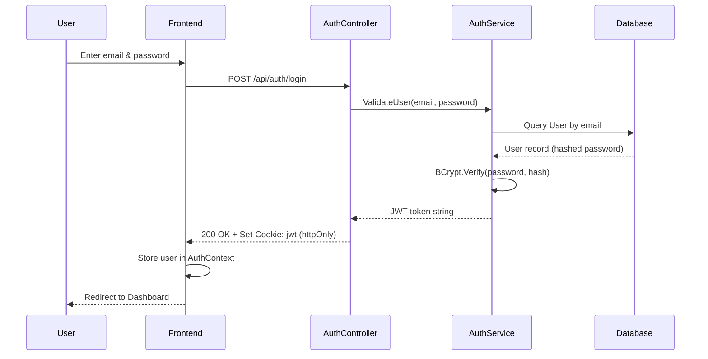
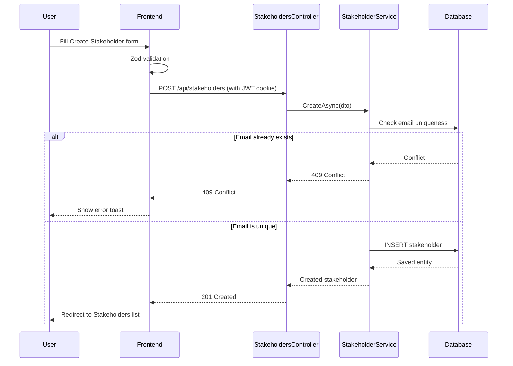
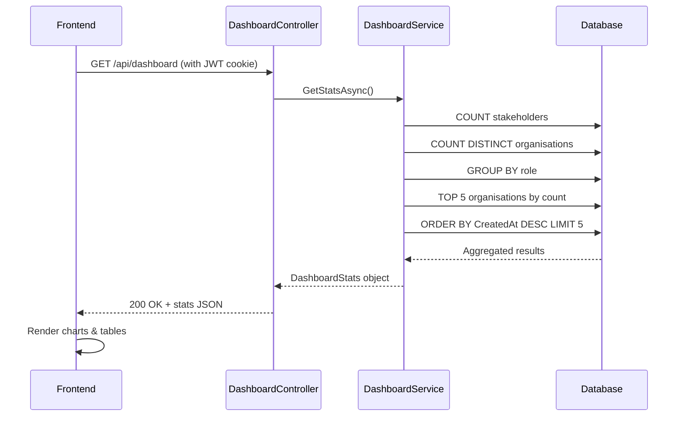
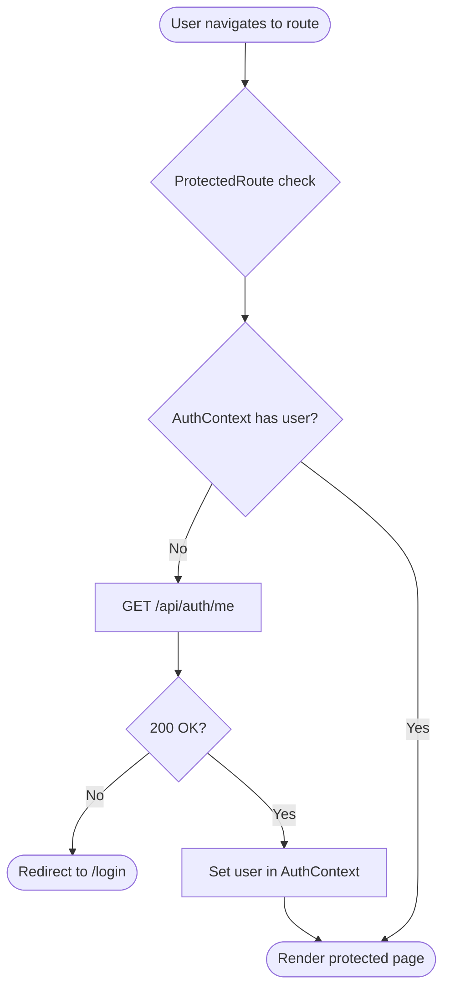

# 📋 Stakeholder Manager

A full-stack stakeholder relationship management tool for tracking contacts, roles, and organizations — with a real-time dashboard and secure JWT authentication.

---

## 🗂️ Table of Contents

- [Overview](#-overview)
- [Features](#-features)
- [Tech Stack](#-tech-stack)
- [Project Structure](#-project-structure)
- [Getting Started](#-getting-started)
- [Configuration](#️-configuration)
- [API Reference](#-api-reference)
- [Process Flows](#-process-flows)
- [Running Tests](#-running-tests)

---

## 🌐 Overview

Stakeholder Manager is a full-stack web application built as a technical test baseline. It provides authenticated access to a paginated stakeholder directory with dashboard analytics — built on ASP.NET Core 8 (backend) and React 18 (frontend).

---

## ✨ Features

- 🔐 JWT authentication via secure httpOnly cookies
- 📊 Dashboard with role breakdown, top organizations, and recent activity
- 👥 Stakeholder CRUD with pagination (5 / 10 / 25 rows per page)
- 📧 Email uniqueness enforcement across all stakeholders
- 📝 Inline edit and delete via dialog
- 🌱 50 sample stakeholders seeded on first run
- 📡 Swagger UI for API exploration (development only)
- 🔔 Optional Discord webhook for audit logging

---

## 🛠️ Tech Stack

### 🖥️ Backend

| Package / Service | Version | Purpose |
|---|---|---|
| ASP.NET Core | 8.0 | Web API framework |
| Entity Framework Core | 8.0 | ORM and migrations |
| Microsoft.EntityFrameworkCore.Sqlite | 8.0 | SQLite database provider |
| Microsoft.AspNetCore.Authentication.JwtBearer | 8.0 | JWT Bearer auth middleware |
| BCrypt.Net-Next | 4.0.3 | Password hashing |
| Serilog.AspNetCore | 8.0 | Structured logging |
| Serilog.Sinks.Discord | — | Discord webhook log sink |
| Swashbuckle.AspNetCore | 6.6 | Swagger / OpenAPI docs |
| xUnit | 2.x | Unit testing framework |
| Moq | 4.x | Mocking for unit tests |

### 🌐 Frontend

| Package / Service | Version | Purpose |
|---|---|---|
| React | 18.2 | UI library |
| TypeScript | 5.2 | Type safety |
| Vite | 5.0 | Dev server and bundler |
| React Router | v6 | Client-side routing |
| React Hook Form | — | Form state management |
| Zod | — | Schema validation |
| TailwindCSS | 4.3 | Utility-first CSS |
| Radix UI | — | Accessible UI primitives |
| Sonner | — | Toast notifications |
| Vitest | — | Unit test runner |
| @vitest/coverage-v8 | — | Test coverage reports |

---

## 📁 Project Structure

```
stakeholder-manager/
├── backend/
│   ├── StakeholderApi/
│   │   ├── Controllers/
│   │   │   ├── AuthController.cs          # Login, logout, /me
│   │   │   ├── StakeholdersController.cs  # Stakeholder CRUD + pagination
│   │   │   └── DashboardController.cs     # Dashboard stats
│   │   ├── Data/
│   │   │   └── AppDbContext.cs            # EF Core DbContext + seeding
│   │   ├── Migrations/                    # EF Core migration files
│   │   ├── Models/                        # Entities & DTOs
│   │   ├── Services/
│   │   │   ├── AuthService.cs
│   │   │   ├── StakeholderService.cs
│   │   │   └── DashboardService.cs
│   │   └── Program.cs                     # App bootstrap, DI, middleware
│   ├── StakeholderApi.Tests/              # xUnit test project
│   └── StakeholderApi.sln
└── frontend/
    └── src/
        ├── components/
        │   ├── ui/                        # Radix-based UI primitives
        │   ├── forms/
        │   ├── AppSidebar.tsx
        │   ├── EditStakeholderDialog.tsx
        │   ├── PageLayout.tsx
        │   ├── ProtectedRoute.tsx
        │   └── StakeholderTable.tsx
        ├── context/
        │   └── AuthContext.tsx
        ├── hooks/
        ├── lib/                           # API client setup
        ├── pages/
        │   ├── LoginPage.tsx
        │   ├── DashboardPage.tsx
        │   ├── StakeholdersPage.tsx
        │   └── CreateStakeholderPage.tsx
        ├── schemas/                       # Zod validation schemas
        ├── services/
        │   ├── authService.ts
        │   ├── stakeholderService.ts
        │   └── dashboardService.ts
        └── types/
```

---

## 🚀 Getting Started

### Prerequisites

- [.NET 8 SDK](https://dotnet.microsoft.com/download)
- [Node.js](https://nodejs.org/) v18+

### 1. Clone the repository

```bash
git clone <repo-url>
cd stakeholder-manager
```

### 2. Run the backend

```bash
cd backend/StakeholderApi
dotnet run
```

The API starts at `http://localhost:5000`.
Swagger UI is available at `http://localhost:5000/swagger` (development only).

> The SQLite database (`stakeholders.db`) is created automatically on first run and seeded with 50 sample stakeholders and a default admin user.

### 3. Run the frontend

```bash
cd frontend
npm install
npm run dev
```

The app is available at `http://localhost:5173`.

### 4. Default login

| Field | Value |
|---|---|
| Email | `palaktank1111@gmail.com` |
| Password | `Test@1234` |

---

## ⚙️ Configuration

Backend configuration lives in `backend/StakeholderApi/appsettings.json` and `appsettings.Development.json`.

### JWT Settings

| Key | Default | Description |
|---|---|---|
| `Jwt:Secret` | *(required)* | HS256 signing key — minimum 32 characters. Replace in production. |
| `Jwt:Issuer` | `StakeholderApi` | Token issuer claim |
| `Jwt:Audience` | `StakeholderApp` | Token audience claim |
| `Jwt:ExpirationHours` | `24` | Token lifetime in hours |

### Seed / Admin User

| Key | Default | Description |
|---|---|---|
| `Seed:AdminEmail` | `palaktank1111@gmail.com` | Email for the seeded admin account |
| `Seed:AdminPassword` | `Test@1234` | Password for the seeded admin account |

> ⚠️ Change `Seed:AdminPassword` and `Jwt:Secret` before any non-local deployment.

### Logging

| Key | Default | Description |
|---|---|---|
| `Discord:WebhookUrl` | *(optional)* | Discord webhook URL — logs errors and stakeholder audit events |

### CORS

| Key | Default | Description |
|---|---|---|
| `AllowedHosts` | `*` | Allowed CORS hosts |

> CORS is explicitly configured to allow `http://localhost:5173` with credentials in development.

### Example `appsettings.Development.json`

```json
{
  "Jwt": {
    "Secret": "super-secret-jwt-signing-key-replace-in-production-32chars",
    "Issuer": "StakeholderApi",
    "Audience": "StakeholderApp",
    "ExpirationHours": 24
  },
  "Seed": {
    "AdminEmail": "palaktank1111@gmail.com",
    "AdminPassword": "Test@1234"
  },
  "Discord": {
    "WebhookUrl": ""
  }
}
```

---

## 📡 API Reference

All endpoints are prefixed with `/api`.

### 🔐 Auth

| Method | Endpoint | Description |
|---|---|---|
| `POST` | `/api/auth/login` | Authenticate and receive JWT cookie |
| `POST` | `/api/auth/logout` | Clear JWT cookie |
| `GET` | `/api/auth/me` | Verify auth and return current user email |

### 👥 Stakeholders

| Method | Endpoint | Description |
|---|---|---|
| `GET` | `/api/stakeholders` | Get paginated stakeholder list (`?page=1&pageSize=10`) |
| `GET` | `/api/stakeholders/{id}` | Get stakeholder by ID |
| `POST` | `/api/stakeholders` | Create a new stakeholder |
| `PUT` | `/api/stakeholders/{id}` | Update an existing stakeholder |
| `DELETE` | `/api/stakeholders/{id}` | Delete a stakeholder |

### 📊 Dashboard

| Method | Endpoint | Description |
|---|---|---|
| `GET` | `/api/dashboard` | Get stats — total count, orgs, role breakdown, top orgs, recent stakeholders |

---

## 🔄 Process Flows

### 🔐 Authentication Flow



### 👥 Stakeholder CRUD Flow



### 📊 Dashboard Data Flow



### 🔒 Protected Route Flow



---

## 🧪 Running Tests

### Backend

```bash
cd backend
dotnet test
```

Coverage report output: `backend/coverage/report/`

### Frontend

```bash
cd frontend
npm test                  # Run all tests
npm run test:coverage     # Generate coverage report
```

---

## 📋 Stakeholder Fields

| Field | Type | Required | Notes |
|---|---|---|---|
| First Name | string | ✅ Yes | — |
| Last Name | string | ✅ Yes | — |
| Email | string | ✅ Yes | Must be unique |
| Role | string | ✅ Yes | — |
| Organisation | string | ✅ Yes | — |
| Title | string | ❌ No | Displayed as `-` when empty |
